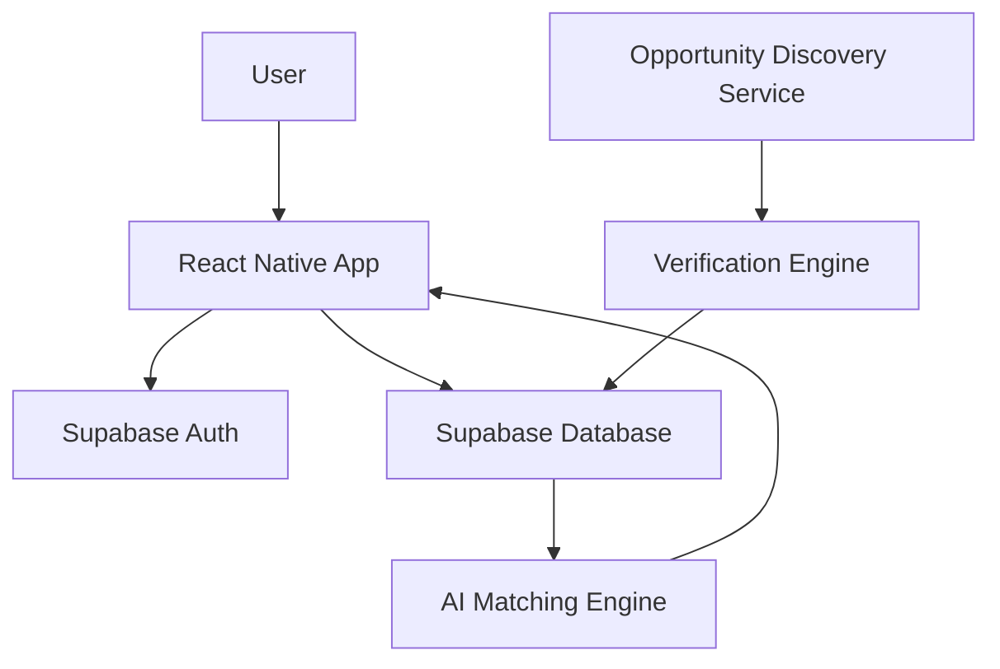

# 🚀 Opportunity OS

<div align="center">


### AI-Powered Opportunity Discovery & Matching Platform

Find verified scholarships, internships, hackathons, fellowships, grants, research programs, startup opportunities, and government benefits tailored to your profile.

</div>

---

# 🌟 Overview

Opportunity OS is a modern AI-powered mobile application that helps users discover, verify, rank, save, and track opportunities from multiple trusted sources.

Instead of manually searching through hundreds of websites, users create a profile once and receive personalized recommendations ranked by:

- 🎯 Profile Match Score
- 🛡 Trust Score
- 🏆 Quality Score
- 📅 Deadline Relevance
- 🤖 AI Ranking Engine

The platform focuses on quality over quantity by surfacing only verified opportunities linked to official application sources.

---

# 🎯 Problem Statement

Students, developers, founders, researchers, and professionals often struggle with:

- Finding legitimate opportunities
- Avoiding scams and fake listings
- Tracking deadlines
- Matching eligibility requirements
- Managing applications

Opportunity OS solves these problems with AI-powered discovery and verification.

---

# ✨ Core Features

## 🔐 Authentication

- User Registration
- Secure Login
- Supabase Authentication
- Session Management
- Profile Persistence

---

## 👤 AI Profile Builder

Users complete a guided onboarding process:

### Identity Types

- Student
- Developer
- Founder
- Professional
- Researcher
- Citizen

### Profile Information

- Skills
- Interests
- Location
- Education
- Career Goals
- Eligibility Information

Used to generate personalized opportunity rankings.

---

## 🔍 Opportunity Discovery

Automatically discovers:

- Scholarships
- Internships
- Hackathons
- Fellowships
- Research Programs
- Startup Accelerators
- Government Benefits
- Grants
- Competitions
- Open Source Programs

---

## 🛡 Opportunity Verification System

Every opportunity receives:

### Trust Score

Measures:

- Official source quality
- Domain credibility
- Verification status

### Quality Score

Measures:

- Completeness
- Information quality
- Opportunity reputation

### Verification Status

- Verified
- Pending
- Rejected

---

## 🤖 AI Matching Engine

Custom matching algorithm ranks opportunities using:

### Inputs

- User skills
- Interests
- Profile type
- Eligibility
- Experience level

### Outputs

- Match Percentage
- Ranking Reason
- Personalized Recommendations

Example:

```text
97% Match
Reason:
Strong alignment with AI, React Native, Startup Building
```

---

## 📚 Explore Screen

Advanced filtering:

### Categories

- Scholarships
- Internships
- Hackathons
- Grants
- Research
- Government
- Fellowships
- Startup Programs

### Sorting

- Best Match
- Highest Trust
- Highest Quality
- Newest
- Deadline Soon

### Search

Keyword-based search across:

- Title
- Description
- Provider
- Skills
- Interests

---

## ❤️ Saved Opportunities

Users can:

- Save opportunities
- Track applications
- Review later
- Monitor progress

---

## 📄 Opportunity Details

Displays:

- Title
- Description
- Provider
- Trust Score
- Match Score
- Deadline
- Category
- Official Application Link

---

## 📈 Discovery Logs

Administrative screen for monitoring:

- AI Discovery Runs
- Verification Counts
- Rejection Counts
- Sync Status
- Discovery Notes

Useful for debugging and quality assurance.

---

# 🏗 Architecture



---

# 🛠 Tech Stack

## Frontend

- React Native
- Expo SDK 51
- TypeScript
- React Navigation
- Reanimated
- Expo Linear Gradient

---

## Backend

- Supabase

Features:

- Authentication
- PostgreSQL Database
- Storage
- API Layer

---

## Development Tools

- Expo Go
- EAS Build
- Git
- GitHub
- VS Code

---

# 📱 Screens

## Authentication

- Welcome Screen
- Login Screen
- Register Screen

## Onboarding

- Profile Builder

## Main App

- Dashboard
- Explore
- AI Match
- Saved
- Profile

## Additional

- Opportunity Detail
- Discovery Logs
- Edit Profile

---

# 🗄 Database Structure

## profiles

Stores:

- User information
- Skills
- Interests
- Profile status

---

## opportunities

Stores:

- Opportunity records
- Categories
- Trust scores
- Quality scores
- Verification status

---

## saved_opportunities

Stores:

- User bookmarks
- Tracking status

---

## opportunity_sync_logs

Stores:

- Discovery history
- Verification metrics
- Sync reports

---

# 🔥 Key Innovations

## Verified-First Approach

Most platforms aggregate opportunities.

Opportunity OS verifies opportunities before surfacing them.

---

## Trust Scoring

Every opportunity receives a measurable trust rating.

---

## AI Personalization

Recommendations adapt to:

- Skills
- Interests
- Goals
- Eligibility

---

## Direct Official Links

No spam.

No affiliate redirections.

Users go directly to the official application source.

---

# 🚀 Local Development

## Clone Repository

```bash
git clone https://github.com/YOUR_USERNAME/opportunity-os.git
```

---

## Install Dependencies

```bash
npm install
```

---

## Configure Environment

Create:

```env
EXPO_PUBLIC_SUPABASE_URL=
EXPO_PUBLIC_SUPABASE_ANON_KEY=
```

---

## Start Development Server

```bash
npx expo start
```

---

## Run Web

```bash
npx expo start --web
```

---

## Android Build

```bash
npx eas-cli build -p android --profile preview
```

---

# 📦 Deployment

Built using:

- Expo EAS Build

Generated:

- Android APK
- Android AAB (future release)

Ready for:

- Internal Testing
- Closed Testing
- Open Testing
- Google Play Store Launch

---

# 🎯 Future Roadmap

### Phase 2

- AI Career Advisor
- Resume Analysis
- Scholarship Essay Assistant
- Smart Deadline Alerts
- Opportunity Recommendation Notifications

### Phase 3

- Organization Dashboard
- Opportunity Submission Portal
- Recruiter Tools
- Advanced Analytics

### Phase 4

- Web Platform
- AI Opportunity Agent
- Global Opportunity Graph

---

# 👨‍💻 Author

### Chiranjeevi Bathula

Founder & Builder of Opportunity OS

Building a trusted AI-powered ecosystem that helps people discover opportunities faster, safer, and smarter.

---

# 📜 License

This project is currently proprietary.

All rights reserved.

Unauthorized redistribution, modification, or commercial use is prohibited without explicit permission.

---

<div align="center">

### 🚀 Opportunity OS

**Discover. Verify. Match. Apply.**

Built with ❤️ using React Native, Expo, Supabase, and AI.

</div>
